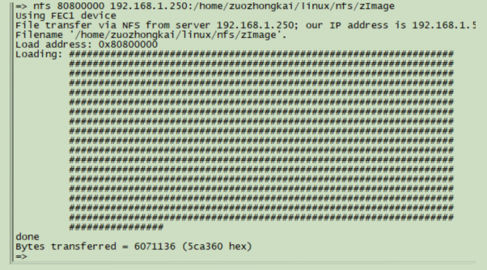
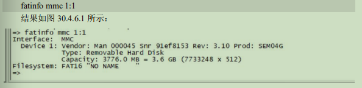
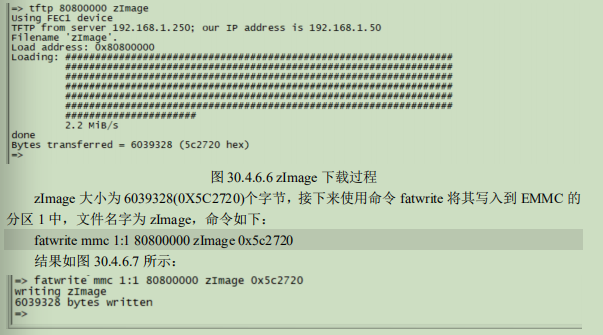

# U-Boot操作命令

#### 1. 信息查询命令

- bdinfo : 查看板子信息

   - printenv: 查看环境变量
   - version: u-boot版本

#### 2. 环境变量操作

   * setenv
   * saveenv

#### 3. 内存操作

   * md: 用于显示内存值

     > md[.b .w .l] address[# of objects]

   * nm: 用于修改指定地址的内存值, 只能对某一地址重复修改

     > nm[.b .w .l] address
     >
     > 

   * mm：修改连续多个地址的内存值

     > mm[.b .w .l] address

   * mw: 用指定的值value填充从指定地址开始的count个数据

     >mw[.b .w .l] address value[count]
     >
     >

   * cp: 把DRAM中的数据从一段地址拷贝的另外一段地址

     > cp[.b .w .l] source target count
     >
     > 

   * cmp : 用于比较两段内存值内容是否相等

     > cmp[.b .w .l] addr1 addr2 count
     >
     > 

#### 4. 网络操作指令

   * ping

   * dhcp: 从路由器申请获得ip地址

   * nfs: 从主机将文件拷贝到指定的内存地址中
      > nfs loadaddr hostIP:filename
      >
      > 

   * tftp: 从主机将文件拷贝到指定的内存地址中

      > tftp loadaddr filename
      >
      > 

#### 5. EMMC SD卡操作

   * mmc info: 用于输出当前选中的mmc info设备的信息

     > 

   * mmc rescan: 用于扫描当前开发板上所有的MMC设置，包括EMMC和SD卡

   * mmc list: 查看有几个MMC设备

     > 

   * mmc dev: 切换MMC设备,不写分区号默认为0

     > mmc dev {dev} {part}
     >
     > 

   * mmc part: 查看当前设备上的分区信息

     > 

   * mmc read: 读取第blk个块开始的cnt个块(扇区)的数据到addr中

     > mmc read addr  blk #cnt
     >
     > 

   * mmc write: 将addr中cnt个块的数据写入MMC第blk个块开始的空间中

     > mmc write addr blk #cnt
     >
     > 

   * mmc erase: 擦除MMC设备

     > mmc erase blk #cnt

#### 6. FAT格式文件系统操作命令

   * fatinfo: 用于查询指定MMC设备指定分区的文件系统信息

     > fatinfo <interface>[dev:part]
     >
     > 

   * fatls: 查询FAT格式设备的目录和文件信息

     > fatls <interface>  dev:part [directory]
     >
     > 

   * fstype: 查看MMC设备某个分区的文件系统格式

     > fstype <interface> dev:part
     >
     > 

   * fatload: 将指定文件读取到DRAM中，byte为读取的字节数，pos为相对文件首地址的偏移量，不指定的话为读取整个文件

     > fatload <interface> dev:part addr filename <byte><pos>
     >
     > 

   * fatwrite: 将DRAM中的数据写入到MMC设备对应的文件中

     > fatwrite <interface> dev:part addr filename <bytes>
     >
     > 

#### 7. EXT文件系统操作指令

   

| ext文件系统操作命令 |
| --------- |
|ext2load |
| ext2ls    |
| ext4load  |
| ext4ls    |
| ext4write |

#### 8. boot操作命令

- bootz: 启动zImage镜像文件

  > bootz imageaddr  initrd[:size] fdt
  >
  > 

- bootm: 用于启动uImage镜像文件，用法与bootz相同

- boot: 运行bootcmd环境变量中的内容来启动linux

  > ****

- reset: 复位uboot

- go: 用于跳到指定的地址处执行应用

  > go addr[arg ...]
  >
  > 

- run: 用于运行环境变量中定义的命令

  > 

- mtest: 内存读写测试命令，可以用来测试自己的开发板上的DDR

  > mtest start  end  pattern  iterations
  >
  > 